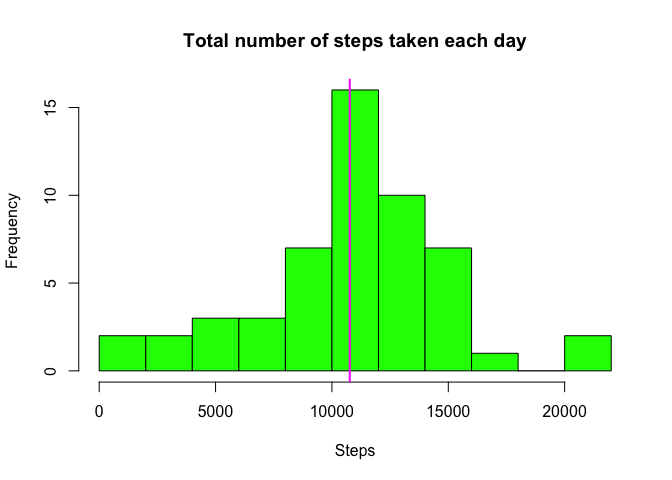
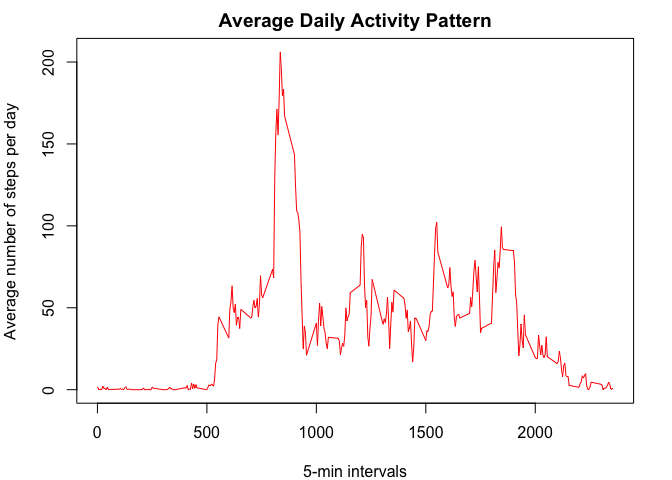
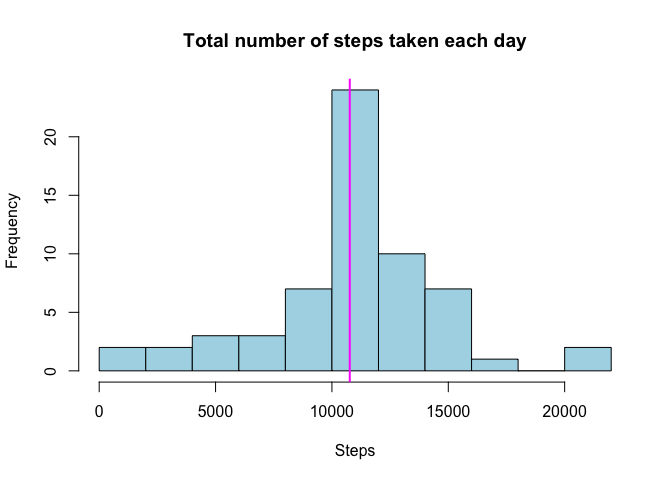
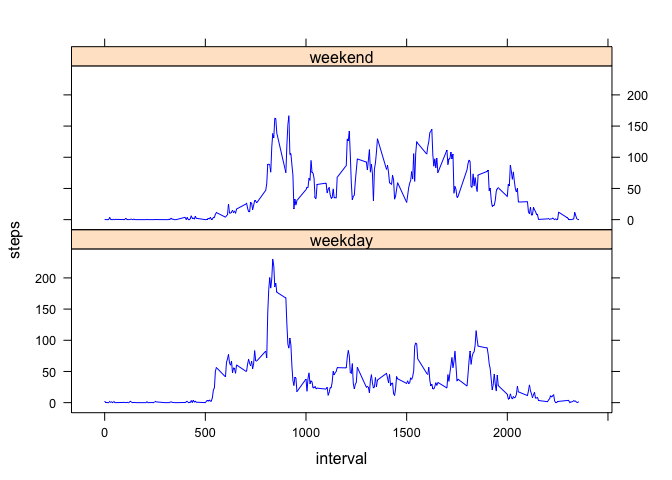

# Reproducible Research: Peer Assessment 1

Fork/clone the [GitHub Repository](http://github.com/rdpeng/RepData_PeerAssessment1) and save all files in your current working directory.

## Loading and preprocessing the data

Unzip and load data from .zip file in working directory.   
Remove all missing values.

```r
unzip("activity.zip")

activity <- read.csv('activity.csv', header = TRUE, na.strings = "NA")
act_clean <- activity[complete.cases(activity), ]
head(act_clean)
```

```
##     steps       date interval
## 289     0 2012-10-02        0
## 290     0 2012-10-02        5
## 291     0 2012-10-02       10
## 292     0 2012-10-02       15
## 293     0 2012-10-02       20
## 294     0 2012-10-02       25
```

Transform data to the convenient formate for further analysis: 

```r
library(data.table)
mydata <- data.frame(Steps = as.numeric(act_clean$steps),
                     Date = as.Date(act_clean$date),
                     Interval = as.numeric(act_clean$interval))
mydata <- as.data.table(mydata)
head(mydata)
```

```
##    Steps       Date Interval
## 1:     0 2012-10-02        0
## 2:     0 2012-10-02        5
## 3:     0 2012-10-02       10
## 4:     0 2012-10-02       15
## 5:     0 2012-10-02       20
## 6:     0 2012-10-02       25
```

## What is mean total number of steps taken per day?

Calculate the total number of steps taken per day using `dlyr package`:

```r
library(dplyr)
```

```r
steps <- group_by(mydata, Date)
totalsteps <- summarize(steps, Steps = sum(Steps))
head(totalsteps)
```

```
##         Date Steps
## 1 2012-10-02   126
## 2 2012-10-03 11352
## 3 2012-10-04 12116
## 4 2012-10-05 13294
## 5 2012-10-06 15420
## 6 2012-10-07 11015
```

Make a histogram of of the total number of steps taken each day.  
Add mean for better data visibility

```r
hist(totalsteps$Steps, xlab = "Steps", breaks = 15, 
     main = "Total number of steps taken each day", col = "green")
abline(v=mean(totalsteps$Steps), col='magenta', lwd = 2)
```

 

Calculate the **mean** and **median** total number of steps taken per day

```r
mean(totalsteps$Steps)
```

```
## [1] 10766.19
```

```r
median(totalsteps$Steps)
```

```
## [1] 10765
```

## What is the average daily activity pattern?

Make a time series plot (i.e. `type="l"`) of the 5-min interval (x-axis) and the average  
number of steps taken, averaged across all days (y-axis) 


```r
int <- strptime(sprintf("%04d", mydata$Interval), format="%H%M")
time <- format(int, "%H:%M")

data_average <- mydata %>% 
        cbind(mydata, time) %>%
        group_by(time) %>%
        summarize(average = round(mean(Steps), digits=2)) %>%
        cbind(interval = mydata$Interval[1:288])

par(mar=c(4,4,2,2))
plot(data_average$interval, data_average$average, type = "l", col="red",
     main = "Average Daily Activity Pattern", 
     xlab = "5-min intervals",
     ylab = "Average number of steps per day")
```

 

Which 5-min interval, on average across all the days in the dataset, contains the maximum  
number of steps? 

```r
max <- max(data_average$average)
data_average[data_average$average==max, ]
```

```
##     time average interval
## 1: 08:35  206.17      835
```

## Imputing missing values

There were a number of days/intervals where there are missing values (coded as NA) in original dataset (var `activity`).   
The presence of missing days may introduce bias into some calculations or summaries of the data.

1. Calculate and report the total number of missing values in the dataset

```r
na <- nrow(activity) - sum(complete.cases(activity))
print(na)
```

```
## [1] 2304
```

2. Create a new dataset that is equal to the original dataset but with the missing data filled in.  
*Strategy*: replace missing values with the average amount of steps taken across days during  specified 5-min interval (`data_average`) 


```r
library(plyr)
newdata <- join(activity, data_average, by="interval") %>%
        mutate(steps=ifelse(is.na(steps), average, steps)) %>%
        select(-average)
newdata <- data.frame(steps = as.numeric(newdata$steps), 
                      date = as.Date(newdata$date), 
                      time=as.factor(newdata$time),
                      interval = as.numeric(newdata$interval))
head(newdata)      
```

```
##   steps       date  time interval
## 1  1.72 2012-10-01 00:00        0
## 2  0.34 2012-10-01 00:05        5
## 3  0.13 2012-10-01 00:10       10
## 4  0.15 2012-10-01 00:15       15
## 5  0.08 2012-10-01 00:20       20
## 6  2.09 2012-10-01 00:25       25
```

3. Make a histogram of the total number of steps taken each day.
Add mean for better data visibility.

```r
bydate <- aggregate(steps ~ date, data=newdata, sum) 

hist(bydate$steps, xlab = "Steps", breaks = 15, 
     main = "Total number of steps taken each day", col = "light blue")
abline(v=mean(bydate$steps), col='magenta', lwd = 2)
```

 

4. Calculate and report the mean and median total number of steps taken per day. 

```r
mean(bydate$steps)
```

```
## [1] 10766.18
```

```r
median(bydate$steps)
```

```
## [1] 10766.13
```
As we can see there is no significant difference from the previous dataset: histogram shape, mean and median values are almost the same.  
We have greater distribution set and total daily steps values are greater as well, but it has very small input on our analysis patterns.

## Are there differences in activity patterns between weekdays and weekends?

1. Create a new factor variable in the dataset with two levels – “weekday” and “weekend” indicating whether a given date is a weekday or weekend day.

```r
library(lubridate)
weekdata <- mutate(newdata, weekday = wday(date)) %>%
        mutate(weekday=ifelse(weekday %in% c(7,1), "weekend", "weekday"))
head(weekdata)
```

```
##   steps       date  time interval weekday
## 1  1.72 2012-10-01 00:00        0 weekday
## 2  0.34 2012-10-01 00:05        5 weekday
## 3  0.13 2012-10-01 00:10       10 weekday
## 4  0.15 2012-10-01 00:15       15 weekday
## 5  0.08 2012-10-01 00:20       20 weekday
## 6  2.09 2012-10-01 00:25       25 weekday
```

2. Make a panel plot containing a time series plot (i.e. type = "l") of the 5-minute interval (x-axis) and the average number of steps taken, averaged across all weekday days or weekend days (y-axis).

```r
week_average <- aggregate(steps ~ interval + weekday, weekdata, mean)

library(lattice)
xyplot(steps~interval|weekday, data = week_average, layout=c(1,2), col="blue", type="l")
```

 
